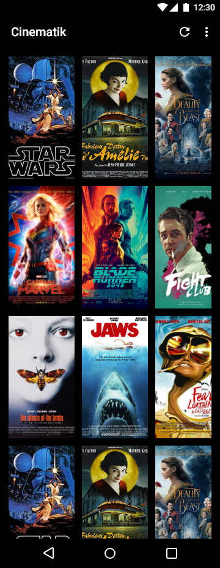

# Android Developer Nanodegree Program | Popular Movies App

In this stage the task was to build the core experience of a movies app.
The app will:

- Present the user with a grid arrangement of movie posters upon launch
- Allow your user to change sort order via a setting, by most popular or by highest-rated
- Allow the user to tap on a movie poster and transition to a details screen with additional information such as original title,
movie poster image thumbnail and so on
- Allow users to view and play trailers ( either in the youtube app or a web browser).
- Allow users to read reviews of a selected movie.
- Also allow users to mark a movie as a favorite in the details view by tapping a button(star).
- Create a database to store the names and ids of the user's favorite movies (and optionally, the rest of the information needed to 
display their favorites collection while offline).
- Modify the existing sorting criteria for the main view to include an additional pivot to show their favorites collection.

# Project Description
The student is required to know how to build clean and compelling user interfaces (UIs), fetch data from network services, 
and optimize the experience for various mobile devices. 
By building this app, they will demonstrate their understanding of the foundational elements of programming for Android.
THe app will communicate with the Internet and provide a responsive and delightful user experience.

 

# Pre-requisites
- Android SDK v22
- Android Build Tools v22.0.1
- Android Support Repository v22.1.1

# Learning Objectives

- Fetch data from the Internet with theMovieDB API
- Use adapters and custom list layouts to populate list views
- Incorporate libraries to simplify the amount of code you need to write
- Build a fully featured application that looks and feels natural on the latest Android operating system 
(Nougat, as of November 2016).
